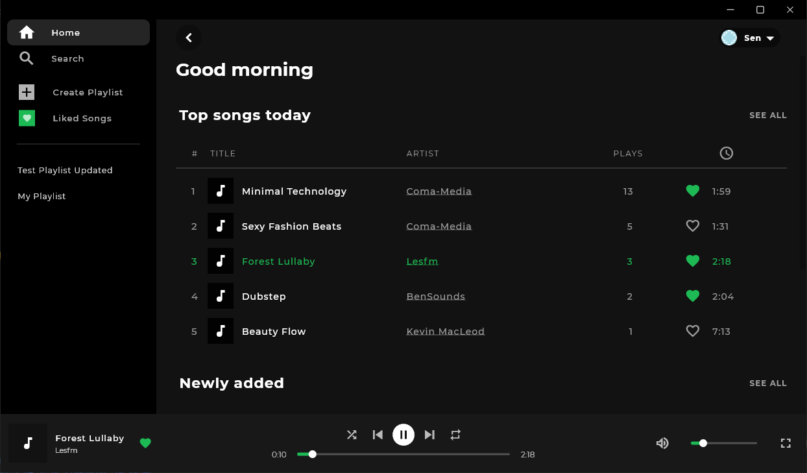
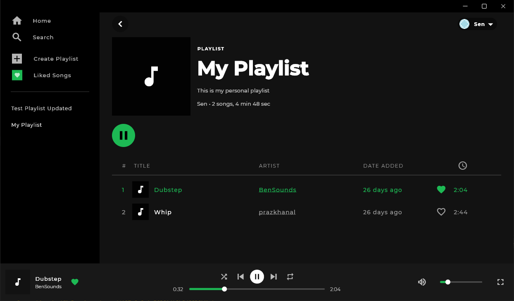
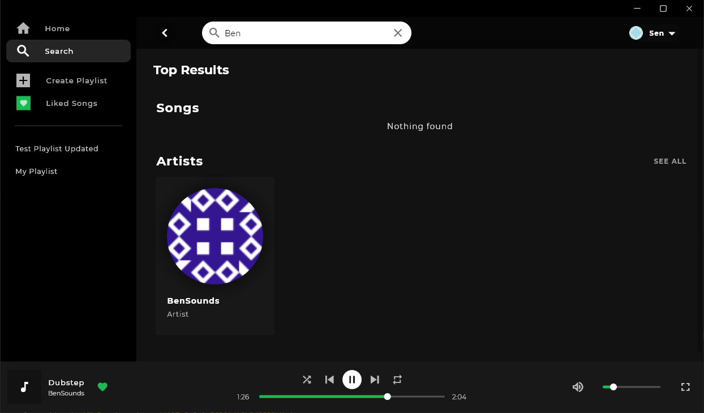

# Horizon

A Spotify clone written using a Go backened and a Flutter desktop app to learn about [gRPC](https://grpc.io/).

## Stack

For more information about each component take a look at their ReadMe's.

- [Server](/server/): The server written in Go.
- [App](/app/): The Flutter application.

## Features

- Account & Profile system
- Users can create and manage playlists
- Listen to songs and playlists
- Like songs
- Search songs and artists

# Screenshots

## Home

## Playlist

## Search

